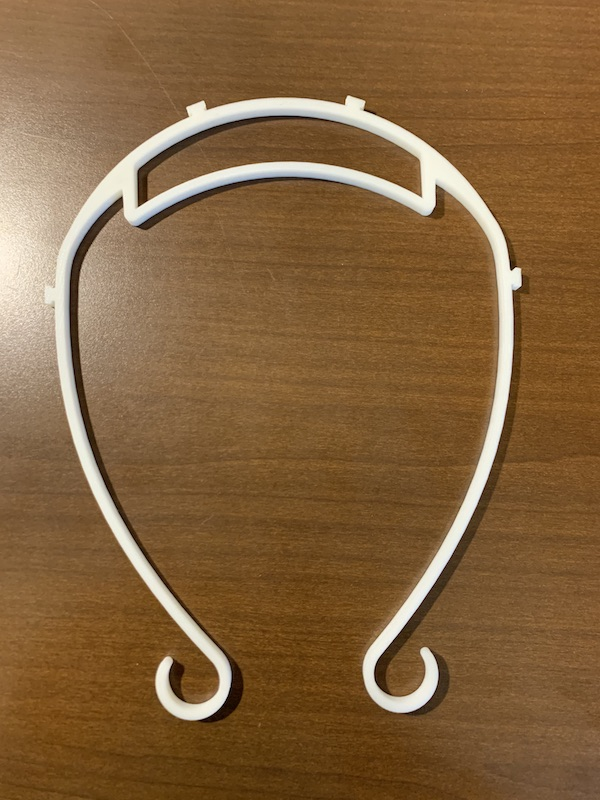

# はじめに
様々な方が本データを使ったり改変したりして、フェイスシールドが必要な場所に届けばと思い、改良を繰り返しながらデータを公開しております。改変なども自由に行ってください。
みなさまの使っている姿を見ることが励みになります。SNSで#doyomodel とハッシュタグをつけて投稿していただけると大変嬉しいです。

道用大介

# 作ったものを他人に渡す場合の注意
つくる側の人は全て感染していることが前提で、製作時はマスクや手袋を着用し、使用予定日の３日前には製作と梱包を終え、引き渡しましょう。できれば出荷前にPLAなら次亜塩素酸ナトリウム（キッチンハイターなど）での消毒が好ましいようです。0.01%(キッチンハイターキャップ１杯に対して水5L）に薄め、５分以上浸しましょう。[参照](https://help.prusa3d.com/en/article/prusa-face-shield-disinfection_125457?fbclid=IwAR1E9TaWje1hrFnzYF6KLgC5qMqZX60T88_2Ch9ydYj7H9O7tvyOMQv_r-4#not-recommended-methodshttps://help.prusa3d.com/en/article/prusa-face-shield-disinfection_125457?fbclid=IwAR1E9TaWje1hrFnzYF6KLgC5qMqZX60T88_2Ch9ydYj7H9O7tvyOMQv_r-4#not-recommended-methods)

# 消毒とクリアファイルの取り替え
繰り返し利用する場合は消毒してください。クリアファイルは作り方を参考に適宜取り替えましょう。
クリアファイルはラミネートフィルムでも代用できます。ラミネートフィルムの方がコストは安く抑えられますが、ラミネーターを通してからのものを使用しないと透明度が出ません。(100μmのものでも強度的に問題ないようです。）透明度はラミネートフィルムのほうが高いです。

# 作り方
いくつかバージョンがあります。

## hybridモデル（特徴：穴あけが簡単＆短時間造形＆輪ゴムより長いゴムが必要になる）
作り方は[ここ](ver2_hybrid/README.md)を参照してください。クリアファイルの穴あけ方法も書いてあります。

## fastモデル（特徴：短時間造形＆輪ゴムより長いゴムが必要になる）
作り方は[ここ](ver2_small/README.md)を参照してください。クリアファイルの穴あけ方法も書いてあります。

## easyモデル（特徴：クリアファイルの穴が開けやすい）
作り方は[ここ](ver1_4hole/README.md)を参照してください。クリアファイルの穴あけ方法も書いてあります。

## basicモデル（初期）
作り方は[ここ](ver1_3hole/README.md)を参照してください。クリアファイルの穴あけ方法も書いてあります。

