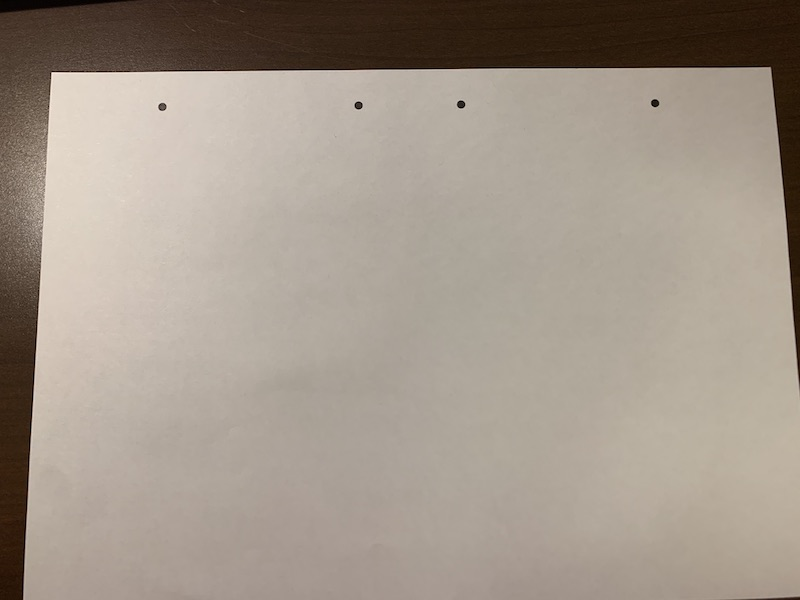
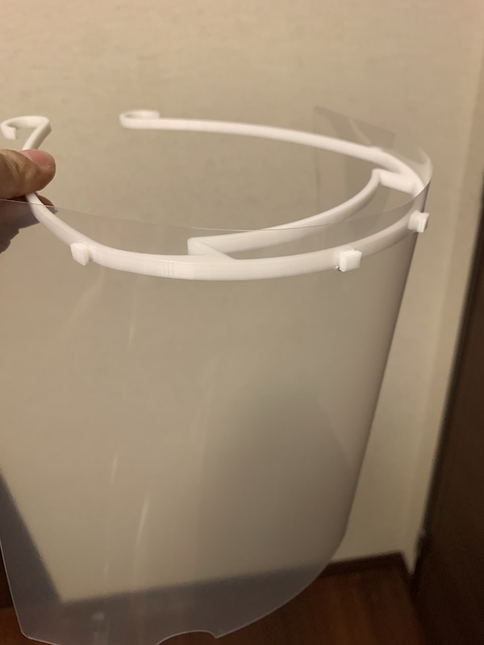

[他のバージョンを見る](https://github.com/doyodoyo/facesheild)

# 作ったものを他人に渡す場合の注意
つくる側の人は全て感染していることが前提で、製作時はマスクや手袋を着用し、使用予定日の３日前には製作と梱包を終え、引き渡しましょう。できれば出荷前にPLAなら次亜塩素酸ナトリウム（キッチンハイターなど）での消毒が好ましいようです。0.01%(キッチンハイターキャップ１杯に対して水5L）に薄め、５分以上浸しましょう。[参照](https://help.prusa3d.com/en/article/prusa-face-shield-disinfection_125457?fbclid=IwAR1E9TaWje1hrFnzYF6KLgC5qMqZX60T88_2Ch9ydYj7H9O7tvyOMQv_r-4#not-recommended-methodshttps://help.prusa3d.com/en/article/prusa-face-shield-disinfection_125457?fbclid=IwAR1E9TaWje1hrFnzYF6KLgC5qMqZX60T88_2Ch9ydYj7H9O7tvyOMQv_r-4#not-recommended-methods)

# 消毒とクリアファイルの取り替え
繰り返し利用する場合は消毒してください。クリアファイルは作り方を参考に適宜取り替えましょう。
クリアファイルはラミネートフィルムでも代用できます。ラミネートフィルムの方がコストは安く抑えられますが、ラミネーターを通してからのものを使用しないと透明度が出ません。(100μmのものでも強度的に問題ないようです。）透明度はラミネートフィルムのほうが高いです。

# Face Sheild(フェイスシールド) hybridモデル

## tools
1. 3Dprinter(3Dプリンター)
2. box cutter(カッター)
3. pen(ボールペンかマジック)
4. Hole punch(穴あけパンチ）

## materials
1. Filament(PLA,PETG)
2. A4 sized file folder (A4クリアファイル)
3. A4 sized paper(A4の紙)
4. rubber band（平ゴム等のバンド）

## 3DPrint
3print this stl file. （このstlファイルをダウンロードして3Dプリントしてください）
[stlファイル](viser_ver2_hybrid.stl)

## print
print this pdf file. (このpdfファイルを印刷してください）
[hole_ver2_hybrid.pdf](hole_ver2_hybrid.pdf)

## cut
cut the file folder(クリアファイルをカッターで半分に切ります）

## mark
mark the hole point with printed paper(印刷した紙の上にクリアファイルをおいて、穴を開ける場所に印をつけます）

## punch
make holes with a hole punch(穴あけパンチで穴を開けます）

## assemble
assemble viser and file folder （組み立てます。写真はeasyモデルです。）

## attention
If you use repeatedly, please disinfect or wash well with soap（繰り返し利用する場合は消毒するか、石鹸でよく洗浄してください。）

